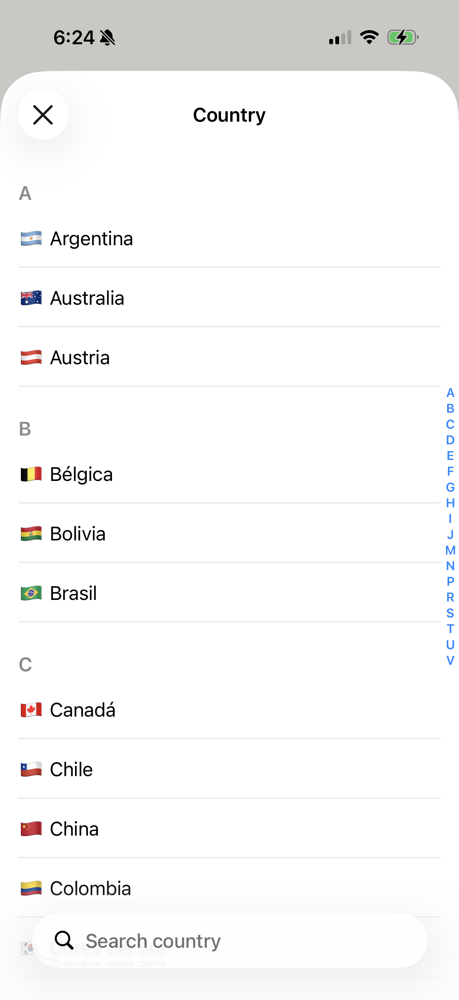

# expo-native-select-picker

[](https://www.npmjs.com/package/expo-native-select-picker)
[](https://github.com/alfonsobries/expo-native-select-picker/actions/workflows/ci.yml)
[](./LICENSE)

Native select picker for Expo and React Native, on **iOS and Android**: the **settings-style option list** — the same table each platform uses to pick your region — with a search field, A–Z sections with the index on the edge, and a check on the selected row. Call it from any trigger and it resolves with the picked value, like a `<select>` should.

<p align="center">
  <picture>
    <source media="(prefers-color-scheme: dark)" srcset="docs/countries-dark.png">
    
  </picture>
  <picture>
    <source media="(prefers-color-scheme: dark)" srcset="docs/short-list-dark.png">
    
  </picture>
</p>

- 🍎 **Real native UI on iOS** — `UITableViewController` + `UISearchController`, exactly what Settings uses. Not a re-implementation.
- 🤖 **Real native UI on Android** — a full-screen dialog with a `RecyclerView`, drawn from your theme attributes. No Material dependency, no theme forced onto your activity.
- 🔍 **Search** — diacritic-insensitive ("mexico" finds "México"), disable it for short lists.
- 🔤 **A–Z sections + index on the edge** — automatic for long lists, controllable via `grouped`.
- ✅ **Check** on the current value; emoji in labels (flags!) work and don't break grouping.
- 🎨 **Wears your design system** — optional `colors` on Android, where the platform surface belongs to no one.
- 🎯 **Headless** — trigger from any button or field; there's no UI to style.
- 🪶 **No JavaScript dependencies.**

## Requirements

- iOS 16+ / Android 7+ (API 24)
- Expo SDK 52+ with a [development build](https://docs.expo.dev/develop/development-builds/introduction/) or a bare React Native app with Expo Modules — this package includes native code, so it does **not** run in Expo Go.

On web the helper resolves `null` so cross-platform code doesn't need guards.

## Installation

```sh
npx expo install expo-native-select-picker
```

Then rebuild your development build (`npx expo run:ios` or an EAS build). If you manage OTA updates with a fixed `runtimeVersion`, adding this package is a native change — bump it.

## Usage

```tsx
import { pickOption } from 'expo-native-select-picker';

const value = await pickOption({
  title: 'Country',
  options: [
    { value: 'mx', label: '🇲🇽 México' },
    { value: 'es', label: '🇪🇸 España' },
    // …
  ],
  selectedValue: 'mx',
  searchPlaceholder: 'Search country',
});

if (value !== null) {
  setCountry(value); // null when dismissed without picking
}
```

### Short lists

```tsx
const priority = await pickOption({
  title: 'Priority',
  options: [
    { value: 'low', label: 'Low' },
    { value: 'medium', label: 'Medium' },
    { value: 'high', label: 'High' },
  ],
  selectedValue: 'medium',
  searchable: false,
});
```

### As a form field

The picker is headless, so wrapping it in a field component of your design system takes a few lines:

```tsx
function Select({ label, value, onChange, options }) {
  return (
    <Pressable
      onPress={async () => {
        const picked = await pickOption({ title: label, options, selectedValue: value });
        if (picked !== null) {
          onChange(picked);
        }
      }}>
      <Text>{options.find((option) => option.value === value)?.label ?? 'Select…'}</Text>
    </Pressable>
  );
}
```

## API

### `pickOption(options): Promise<string | null>`

Presents the option list natively — a page sheet on iOS, a full-screen dialog on Android — and resolves with the picked `value`, or `null` when dismissed without picking (close button, swipe, or back gesture).

### `SelectPickerOptions`

| Option              | Type                 | Default   | Description                                                                      |
| ------------------- | -------------------- | --------- | -------------------------------------------------------------------------------- |
| `options`           | `SelectOption[]`     | —         | The list to pick from: `{ value: string, label: string }`. Emoji in labels work. |
| `title`             | `string`             | —         | Navigation-bar title of the sheet.                                               |
| `selectedValue`     | `string`             | —         | Value shown with a checkmark.                                                    |
| `searchable`        | `boolean`            | `true`    | Native search bar; matching is case- and diacritic-insensitive.                  |
| `searchPlaceholder` | `string`             | system    | Placeholder of the search bar.                                                   |
| `grouped`           | `boolean`            | automatic | A–Z sections with the index on the edge. Automatic turns it on at 30+ options.   |
| `colors`            | `SelectPickerColors` | theme     | Android only. See below.                                                         |

Grouping keys on the first _letter_ of each label, so a leading flag or emoji doesn't affect it; labels that start with no letter land under `#`.

### `SelectPickerColors` — Android only

Android's default surface is a grey that belongs to no design system, so the list can be told your colors. Anything left out falls back to the app's theme.

| Color        | What it paints                                         |
| ------------ | ------------------------------------------------------ |
| `background` | The sheet.                                             |
| `label`      | Option labels and the title.                           |
| `muted`      | Search placeholder, section headings, the search icon. |
| `accent`     | The check on the selected row and the A–Z index.       |

```tsx
await pickOption({
  options: countries,
  colors: { background: '#020617', label: '#f8fafc', muted: '#64748b', accent: '#f43f5e' },
});
```

**iOS ignores them by design.** There the list _is_ the system sheet, and repainting it is the one thing that would make it look non-native.

## Example

The [`example`](./example) app demonstrates the searchable country list, a short list without search, and preselected values:

```sh
cd example
npx expo run:ios
```

## Contributing

Issues and PRs are welcome. Commits follow [Conventional Commits](https://www.conventionalcommits.org) — releases and the changelog are generated from them.

```sh
npm install
npm run lint
npm test
npm run build
```

## License

[MIT](./LICENSE) © [Alfonso Bribiesca](https://alfonsobries.com)
